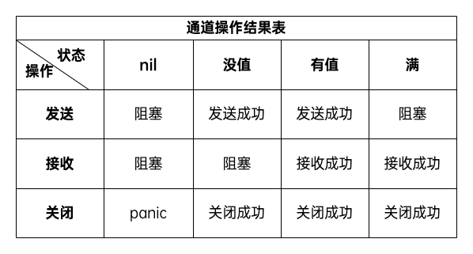

# 管道

## 关闭通道
* 对一个关闭的通道再发送值就会导致 panic。
* 对一个关闭的通道进行接收会一直获取值直到通道为空。
* 对一个关闭的并且没有值的通道执行接收操作会得到对应类型的零值。
* 关闭一个已经关闭的通道会导致 panic。

## for读取管道数据
* 需要判断管道是否关闭，不然当管道关闭时会一直读取到0值

## for range读取管道数据
* 阻塞式读取，管道关闭自动结束

## 不同状态下的通道执行相应操作的结果
